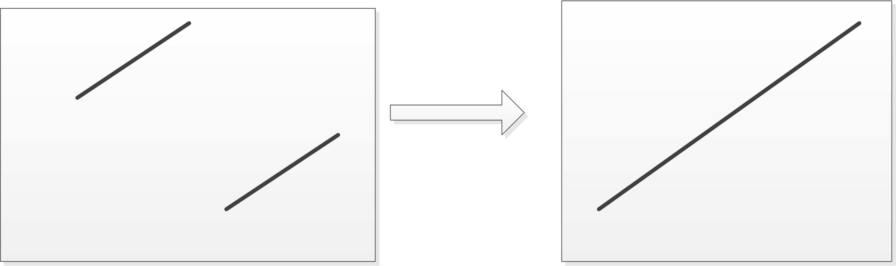

# Find Minimum in Rotated Sorted Array

## Question

- leetcode: [Find Minimum in Rotated Sorted Array | LeetCode OJ](https://leetcode.com/problems/find-minimum-in-rotated-sorted-array/)
- lintcode: [(159) Find Minimum in Rotated Sorted Array](http://www.lintcode.com/en/problem/find-minimum-in-rotated-sorted-array/)

### Problem Statement

Suppose a sorted array is rotated at some pivot unknown to you beforehand.

(i.e., `0 1 2 4 5 6 7` might become `4 5 6 7 0 1 2`).

Find the minimum element.

#### Example

Given `[4, 5, 6, 7, 0, 1, 2]` return `0`

#### Note

You may assume no duplicate exists in the array.


## 题解

如前节所述，对于旋转数组的分析可使用画图的方法，如下图所示，升序数组经旋转后可能为如下两种形式。



最小值可能在上图中的两种位置出现，如果仍然使用数组首部元素作为target去比较，则需要考虑图中右侧情况。**使用逆向思维分析，如果使用数组尾部元素分析，则无需图中右侧的特殊情况。**不过考虑在内的话也算是一种优化。


### Java

```java
public class Solution {
    /**
     * @param num: a rotated sorted array
     * @return: the minimum number in the array
     */
    public int findMin(int[] num) {
        if (num == null || num.length == 0) return Integer.MIN_VALUE;

        int lb = 0, ub = num.length - 1;
        // case1: num[0] < num[num.length - 1]
        // if (num[lb] < num[ub]) return num[lb];

        // case2: num[0] > num[num.length - 1] or num[0] < num[num.length - 1]
        while (lb + 1 < ub) {
            int mid = lb + (ub - lb) / 2;
            if (num[mid] < num[ub]) {
                ub = mid;
            } else {
                lb = mid;
            }
        }

        return Math.min(num[lb], num[ub]);
    }
}
```

### 源码分析

仅需注意使用`num[end]`(使用 num[lb]不是那么直观)作为判断依据即可，由于题中已给无重复数组的条件，故无需处理`num[mid] == num[end]`特殊条件。

### 复杂度分析

由于无重复元素，平均情况下复杂度为 $$O(\log n)$$.

### 分析

从左向右扫描，扫描到的第一个逆序的位置，肯定是原始数组中第一个元素，时间复杂度`O(n)`。

不过本题依旧可以用二分查找，最关键的是要判断那个“断层”是在左边还是右边。

* 若`A[mid] < A[right]`，则区间`[mid,right]`一定递增，断层一定在左边
* 若`A[mid] > A[right]`，则区间`[left,mid]`一定递增，断层一定在右边
* `nums[mid] == nums[right]`，这种情况不可能发生，因为数组是严格单调递增的，不存在重复元素

### 代码



