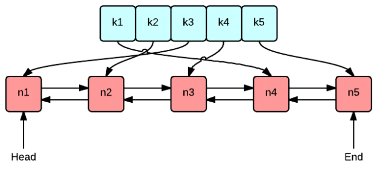

# LRU Cache

## Question

- leetcode: [LRU Cache | LeetCode OJ](https://leetcode.com/problems/lru-cache/)
- lintcode: [(134) LRU Cache](http://www.lintcode.com/en/problem/lru-cache/)

### Problem Statement


Design and implement a data structure for Least Recently Used (LRU) cache. It should support the following operations: `get` and `set`.

`get(key)` - Get the value (will always be positive) of the key if the key exists in the cache, otherwise return -1.

`set(key, value)` - Set or insert the value if the key is not already present. When the cache reached its capacity, it should invalidate the least recently used item before inserting a new item.

## 题解

### Java

```java
public class Solution {
private int capacity;
	private HashMap<Integer, Node> map = new HashMap<>();
	private Node head = new Node(-1, -1), tail = new Node(-1, -1);

	private class Node {
		Node prev, next;
		int val, key;

		public Node(int key, int val) {
			this.val = val;
			this.key = key;
			prev = null;
			next = null;
		}

// 		@Override
// 		public String toString() {
// 			return "(" + key + ", " + val + ") " + "last:"
// 					+ (prev == null ? "null" : "node");
// 		}
	}

	public Solution(int capacity) {
		this.capacity = capacity;
		tail.prev = head;
		head.next = tail;
	}

	public int get(int key) {
		if (!map.containsKey(key)) {
			return -1;
		}
		// remove current
		Node currentNode = map.get(key);
		currentNode.prev.next = currentNode.next;
		currentNode.next.prev = currentNode.prev;
		
		// move current to tail;
		moveToTail(currentNode);
		
		return map.get(key).val;
	}

	public void set(int key, int value) {
		if (get(key) != -1) {
			map.get(key).val = value;
			return;
		}
		if (map.size() == capacity) {
			map.remove(head.next.key);
			head.next = head.next.next;
			head.next.prev = head;
		}
		Node insert = new Node(key, value);
		map.put(key, insert);
		moveToTail(insert);
	}
	
	private void moveToTail(Node current) {
		current.prev = tail.prev;
		tail.prev = current;
		current.prev.next = current;
		current.next = tail;
	}
}

```
### 分析

为了使查找、插入和删除都有较高的性能，这题的关键是要使用一个双向链表和一个HashMap，因为：

* HashMap保存每个节点的地址，可以基本保证在`O(1)`时间内查找节点
* 双向链表能后在`O(1)`时间内添加和删除节点，单链表则不行


具体实现细节：

* 越靠近链表头部，表示节点上次访问距离现在时间最短，尾部的节点表示最近访问最少
* 访问节点时，如果节点存在，把该节点交换到链表头部，同时更新hash表中该节点的地址
* 插入节点时，如果cache的size达到了上限capacity，则删除尾部节点，同时要在hash表中删除对应的项；新节点插入链表头部



### 代码

Java中也有双向链表`LinkedList`, 但是 `LinkedList` 封装的太深，没有能在`O(1)`时间内删除中间某个元素的API(C++的`list`有个`splice()`, O(1), 所以本题C++可以放心使用`splice()`)，于是我们只能自己实现一个双向链表。

本题有的人直接用 `LinkedHashMap` ，代码更短，但这是一种偷懒做法，面试官一定会让你自己重新实现。

```java
// LRU Cache
// 时间复杂度O(logn)，空间复杂度O(n)
public class LRUCache {
    private int capacity;
    private final HashMap<Integer, Node> map;
    private Node head;
    private Node end;

    public LRUCache(int capacity) {
        this.capacity = capacity;
        map = new HashMap<>();
    }

    public int get(int key) {
        if(map.containsKey(key)){
            Node n = map.get(key);
            remove(n);
            setHead(n);
            return n.value;
        }

        return -1;
    }

    public void set(int key, int value) {
        if (map.containsKey(key)){
            Node old = map.get(key);
            old.value = value;
            remove(old);
            setHead(old);
        } else {
            Node created = new Node(key, value);
            if (map.size() >= capacity){
                map.remove(end.key);
                remove(end);
                setHead(created);
            } else {
                setHead(created);
            }

            map.put(key, created);
        }
    }

    private void remove(Node n){
        if (n.prev !=null) {
            n.prev.next = n.next;
        } else {
            head = n.next;
        }

        if (n.next != null) {
            n.next.prev = n.prev;
        } else {
            end = n.prev;
        }

    }

    private void setHead(Node n){
        n.next = head;
        n.prev = null;

        if (head!=null ) head.prev = n;

        head = n;

        if(end == null) end = head;
    }

    // doubly linked list
    static class Node {
        int key;
        int value;
        Node prev;
        Node next;

        public Node(int key, int value) {
            this.key = key;
            this.value = value;
        }
    }
}
```
