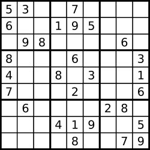

# Valid Sudoku

## Question

- leetcode: [Valid Sudoku | LeetCode OJ](https://leetcode.com/problems/valid-sudoku/)
- lintcode: [(389) Valid Sudoku](http://www.lintcode.com/en/problem/valid-sudoku/)

```
Determine whether a Sudoku is valid.

The Sudoku board could be partially filled,
where empty cells are filled with the character ..

Example
The following partially filed sudoku is valid.
```



```
Valid Sudoku

Note
A valid Sudoku board (partially filled) is not necessarily solvable.
Only the filled cells need to be validated.
Clarification
What is Sudoku?

http://sudoku.com.au/TheRules.aspx
https://zh.wikipedia.org/wiki/%E6%95%B8%E7%8D%A8
https://en.wikipedia.org/wiki/Sudoku
http://baike.baidu.com/subview/961/10842669.htm
```

## 题解

看懂数独的含义就好了，分为三点考虑，一是每行无重复数字；二是每列无重复数字；三是小的九宫格中无重复数字。

### Java

```java
class Solution {
    /**
      * @param board: the board
        @return: wether the Sudoku is valid
      */
    public boolean isValidSudoku(char[][] board) {
        if (board == null || board.length == 0) return false;

        // check row
        for (int i = 0; i < 9; i++) {
            boolean[] numUsed = new boolean[9];
            for (int j = 0; j < 9; j++) {
                if (isDuplicate(board[i][j], numUsed)) {
                    return false;
                }
            }
        }

        // check column
        for (int i = 0; i < 9; i++) {
            boolean[] numUsed = new boolean[9];
            for (int j = 0; j < 9; j++) {
                if (isDuplicate(board[j][i], numUsed)) {
                    return false;
                }
            }
        }

        // check sub box
        for (int i = 0; i < 9; i = i + 3) {
            for (int j = 0; j < 9; j = j + 3) {
                if (!isValidBox(board, i, j)) {
                    return false;
                }
            }
        }

        return true;
    }

    private boolean isValidBox(char[][] box, int x, int y) {
        boolean[] numUsed = new boolean[9];
        for (int i = x; i < x + 3; i++) {
            for (int j = y; j < y + 3; j++) {
                if (isDuplicate(box[i][j], numUsed)) {
                    return false;
                }
            }
        }
        return true;
    }

    private boolean isDuplicate(char c, boolean[] numUsed) {
        if (c == '.') {
            return false;
        } else if (numUsed[c - '1']) {
            return true;
        } else {
            numUsed[c - '1'] = true;
            return false;
        }
    }
}
```

### 源码分析

首先实现两个小的子功能模块判断是否有重复和小的九宫格是否重复。

### 复杂度分析

略

## Reference

- Soulmachine 的 leetcode 题解
